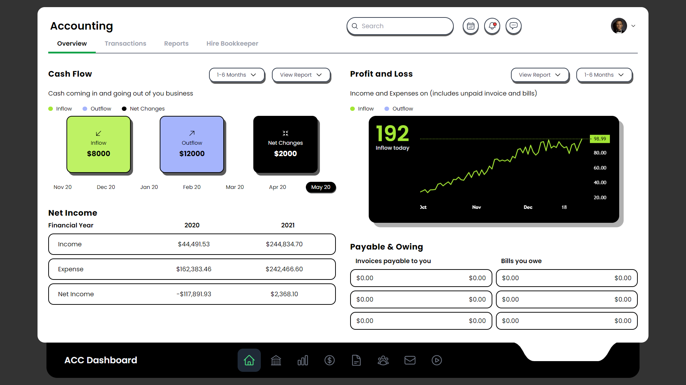

# Accounting Dashboard Interface - TailWindCSS

- *NOTE: This is an example project developed by [@shakirsamoon](https://github.com/shakirsamoon). Feel free to explore, clone or fork the repo as per your liking. In exchange, I would like a star for the repository. Thank you in Advance.*

- This design was originally designed by [Ghulam Rasool](https://dribbble.com/ghulaam-rasool). [Click here to see his design](https://dribbble.com/shots/18968094-Accounting-Dashboard-Design) and show some love.
	

## Project details:

- Developed on React.js (18.2.0) with TypeScript (4.9.4)
- UI library: [TailwindCSS](https://tailwindcss.com/) (3.2.4)
- Icons: [HeroIcons](https://heroicons.com/) (2.0.13)
- Chart: [Lightweight Charts](https://www.tradingview.com/lightweight-charts/) (3.8.0)

## Screenshot



## Getting Started

- Run below commands

```
npm install
npm start
```